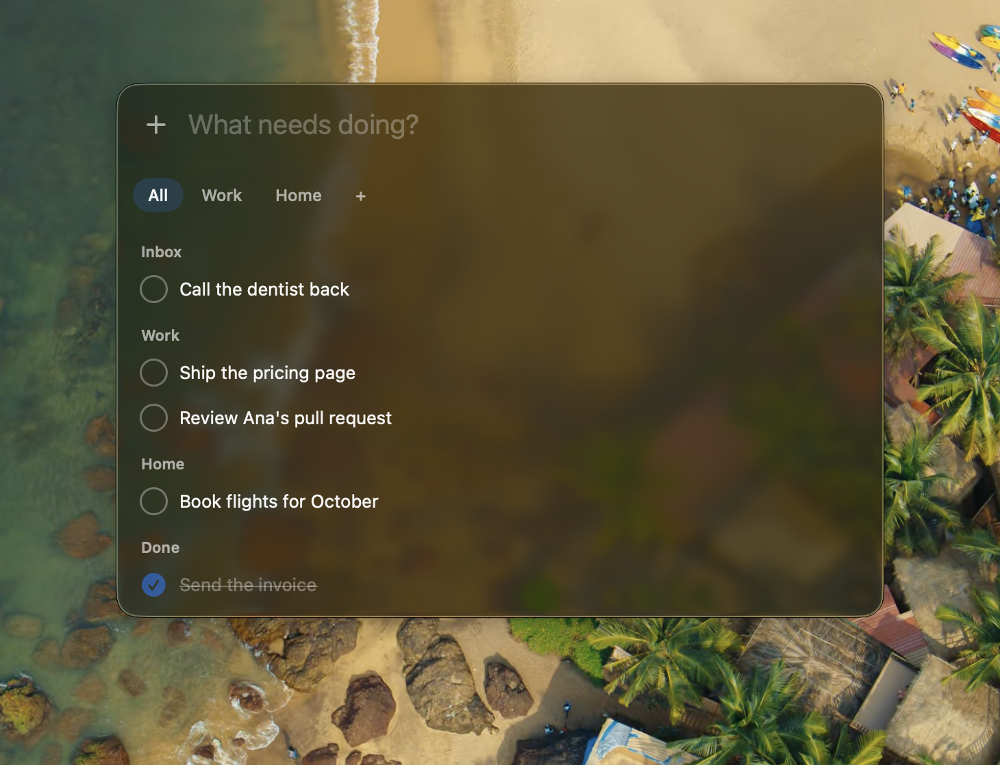

# Today

**A floating, keyboard-only todo panel for macOS.**

Press ⌥Space in any app and it appears over whatever you were doing. Press Esc
and it is gone. There is no window to find, no Dock icon, and nothing to click.
The panel is the entire app.



> Requires macOS 26. The panel is Liquid Glass.

---

## What it does

### Capture
The field at the top is focused the moment the panel opens. Type, press Enter,
and the task is at the top of the list. The panel stays open so you can keep
going, or Esc back to what you were doing.

### Spaces
Tabs under the field split tasks into spaces such as *Work* and *Home*.

- **⌘1** shows everything, grouped by space.
- **⌘2 – ⌘9** jump to one space. Whatever tab is showing is where new tasks go.
- **⌘N** or the `+` pill creates a space. Right-click a space to rename or delete it.
  Deleting a space keeps its tasks and unfiles them.

### Today's list
Everything not done, plus what you finished today. Move with `j` / `k` or the
arrows, complete with Space.

A completed task holds its place for a beat, then settles into a **Done**
section at the bottom. When the last task in a tab is done, the list collapses
to one line:

> All clear · 4 done today

### Snooze
**⌘S** hides a task until tomorrow. It waits in a **Snoozed** section at the
bottom, dimmed, where ⌘S wakes it early. At midnight it comes back on its own,
at the top of its space.

### Order
New tasks go to the top. **⌥↑** and **⌥↓** move a task within its space.

### Task screen
Enter (or double-click) opens a task in place: the title, editable, with notes
underneath. The panel keeps its height, so nothing jumps. Everything saves as
you type; Esc returns you to the same row.

### Undo
**⌘Z** reverses a completion, a snooze, a delete, or an edit.

### Sync
Tasks live in a SwiftData store and mirror to your private iCloud container
when the app is signed with a team. Unsigned builds stay local.

### Nothing else
No due dates, tags, priorities, settings, or onboarding. The menubar icon has
three items: Open, Launch at Login, Quit.

---

## Keys

#### Anywhere

| Key | |
| :-- | :-- |
| ⌥Space | Open or close the panel |

#### In the field

| Key | |
| :-- | :-- |
| Enter | Add what you typed to the current tab |
| ↓ | Move into the list |
| Esc | Clear the field, or close the panel if it is empty |

#### Tabs

| Key | |
| :-- | :-- |
| ⌘1 | Show everything |
| ⌘2 – ⌘9 | Show a space |
| Tab / ⇧Tab | Cycle through tabs |
| ⌘N | New space |

#### In the list

| Key | |
| :-- | :-- |
| j / k, ↑ / ↓ | Move through the list |
| Space | Complete, or un-complete |
| Enter | Open the task |
| ⌘S | Snooze until tomorrow, or wake |
| ⌥↑ / ⌥↓ | Move the task up or down |
| ⌘⌫ | Delete |
| ⌘Z | Undo |
| ↑ past the top, or any letter | Back to the field |

#### In a task

| Key | |
| :-- | :-- |
| Enter (in the title) | Jump to notes |
| ⌘↩ | Complete, or un-complete |
| Esc | Back to the list, same row |

---

## Setup

1. Open `Today.xcodeproj` in Xcode.
2. Select the **Today** target › *Signing & Capabilities* › pick your team.
   You only do this once; it is what turns on iCloud sync.
3. ⌘R.

Or from the terminal, unsigned and local-only:

```sh
xcodebuild -project Today.xcodeproj -scheme Today -derivedDataPath build CODE_SIGNING_ALLOWED=NO build
open build/Build/Products/Debug/Today.app
```

---

## Notes

- **Hotkey taken?** Some input-source switchers use ⌥Space. Change the modifier
  in `Today/App/HotKey.swift`.
- **Data** is at `~/Library/Application Support/Today/Today.store`. Signed
  builds mirror it to the CloudKit container `iCloud.com.brandongomes.today`;
  unsigned builds detect the missing entitlement and stay local.
  See `Today/Models/Store.swift`.
- **Project file** is generated from `project.yml`. After editing it, run
  `brew install xcodegen && xcodegen`.
- **Sound** is synthesised by `scripts/make_sounds.py`. Edit the numbers, run
  it again, rebuild.
